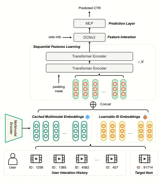
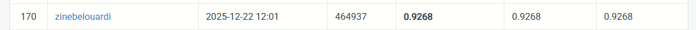

<<<<<<< HEAD
<<<<<<< HEAD
=======
>>>>>>> 0d68dc3243fe9ca74dedf110ea757b530f80f3fc
#  Multimodal CTR Prediction System

## 📌 Overview
Ce projet propose une **architecture neuronale multimodale hiérarchique** pour la prédiction du **Click-Through Rate (CTR)**.

L'objectif est de capturer :
- les interactions complexes entre utilisateurs et contenu
- les dépendances séquentielles
- les relations croisées entre features

---

##  Architecture globale

---

#  Task 1: Multimodal Embedding Extraction

##  Objectif
Transformer différentes modalités (texte, image, metadata) en **représentations vectorielles riches (embeddings)**.

##  Pipeline

### 1. Encodage multimodal
- Utilisation de **SigLIP** pour encoder :
  -  Images
  -  Texte

 Produit des embeddings alignés dans un même espace vectoriel.

---

### 2. Encodage des features contextuelles
Les données suivantes sont transformées en embeddings :
- tags
- vues
- likes

---

### 3. Modélisation séquentielle
Les embeddings sont injectés dans un **Transformer** :

- Capture les dépendances temporelles
- Modélise le comportement utilisateur
- Apprend les interactions séquentielles

---

##  Output Task 1
Un vecteur enrichi combinant :
- embeddings multimodaux
- contexte utilisateur
- historique séquentiel

---

#  Task 2: CTR Prediction

##  Objectif
Prédire la probabilité de clic (CTR) à partir des représentations apprises.

---

##  Pipeline

### 1. Fusion des features
Concaténation de :
- embeddings du Transformer
- features contextuelles

---

### 2. Apprentissage des interactions

####  DCNv2 (Deep & Cross Network)
- Capture les interactions **explicites**
- Apprend les relations croisées entre features

####  DNN (Deep Neural Network)
- Capture les interactions **implicites**
- Apprentissage non linéaire

---

### 3. Prédiction finale

- Fusion DCNv2 + DNN
- Passage dans un **MLP**
- Output : probabilité de clic

---

##  Output Task 2

-  CTR prediction (probabilité)
-  optimisation de la précision

---

##  Points forts

-  Architecture multimodale (image + texte)
-  Modélisation séquentielle (Transformer)
-  Feature crossing avancé (DCNv2)
-  Fusion hybride (explicite + implicite)
-  Pipeline end-to-end

---

##  Technologies

- PyTorch
- Transformers
- SigLIP
- DCNv2
- Deep Learning

---
##  Résultats

<<<<<<< HEAD
=======
## References

This project is built upon [1st Place Solution of WWW 2025 EReL@MIR Workshop
Multimodal CTR Prediction Challenge](https://arxiv.org/pdf/2505.03543) with all components  reimplemented from scratch, and small yet influential adjustments, including changes to embedding dimensions and modifications in how certain inputs are handled and integrated into the model.

## Overall Architecture

The pipeline follows a **four-stage design**:

### 1. Item Representation

Each item embedding is built by concatenating:
- Item ID embedding (learnable)
- Multiple tag embeddings (learnable)
- Frozen multimodal embedding (precomputed, non-trainable) (first used the ones provided, later extracted then used mine)

This yields a rich multimodal item representation.

---

### 2. Sequential Feature Learning

User interaction history is processed using a Transformer encoder.
Each historical item is concatenated with the target item embedding.

The model extracts:
- Short-term interest (last *k* interactions)
- Long-term interest (masked max-pooling)

**Output:** a fixed-size sequential feature vector.

---

### 3. Feature Interaction (DCNv2)

Target item embedding, side features, and sequential features are concatenated.
A Deep & Cross Network v2 (DCNv2) models:
- Explicit feature crosses
- High-order nonlinear interactions
- later, instead of passing the whole item, we passed only its Id_embedding.
---

### 4. CTR Prediction

A lightweight MLP with sigmoid activation predicts the click probability.
The model is trained using binary cross-entropy loss.

---

## Data Handling

- Parquet datasets from the WWW 2025 MM-CTR benchmark
- Custom Dataset for sequence padding and truncation
- Collator for efficient batching
- Frozen multimodal embeddings are loaded once and reused across the model

---

## Training Details

- **Optimizer:** Adam  
- **Loss:** Binary Cross-Entropy  

**Metrics:**
- ROC-AUC
- LogLoss
- Accuracy  

**Training strategies:**
- Gradient clipping
- L2 regularization
- Early stopping
- Learning rate scheduling

---

## Notes on Modifications

- Complete reimplementation of all model components
- Modified embedding dimensionality
- Revised input preprocessing and integration
- Modular and extensible architecture

## Results & Discussion

The proposed model achieves a ROC-AUC score of 0.9307 on the test set.
While this performance does not fully match the original winning solution, it demonstrates that the reimplemented architecture is able to effectively capture multimodal, sequential, and feature interaction signals.

Notably, this performance was reached after only 5 training epochs, indicating fast convergence and stable optimization.
Due to **time constraints and limited computational resources**, further hyperparameter tuning and extended experimentation (e.g., deeper architectures, alternative embedding sizes, or longer training schedules) were not feasible.

We believe that additional tuning and scaling would likely lead to further performance improvements.

>>>>>>> 3ff8691 (Correction du bug dans visualiser)
=======
>>>>>>> 0d68dc3243fe9ca74dedf110ea757b530f80f3fc
